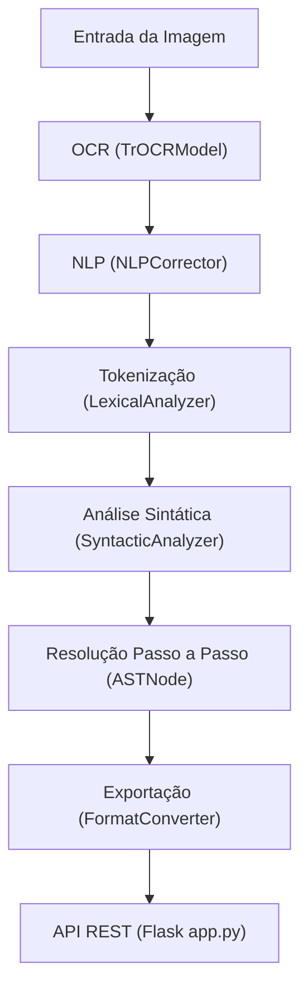

# API para Extração, Interpretação e Resolução Passo a Passo de Expressões Aritméticas Manuscritas

**API for Extraction, Interpretation, and Step-by-Step Resolution of Handwritten Arithmetic Expressions**

[](LICENSE)
[](https://www.python.org/)
[](https://flask.palletsprojects.com/)

---

## Sumário

- [Sobre o Projeto](#sobre-o-projeto)
- [Principais Funcionalidades](#principais-funcionalidades)
- [Arquitetura e Fluxo de Processamento](#arquitetura-e-fluxo-de-processamento)
- [Tecnologias Utilizadas](#tecnologias-utilizadas)
- [Instalação e Uso](#instalação-e-uso)
- [Referências](#referências)
- [Licença](#licença)
- [Autores](#autores)

---

## Sobre o Projeto

Este repositório implementa uma API de código aberto, baseada em Python, dedicada à extração, interpretação e resolução passo a passo de expressões aritméticas manuscritas a partir de imagens. O sistema integra tecnologias de OCR (Reconhecimento Óptico de Caracteres), NLP (Processamento de Linguagem Natural) e autômatos para análise léxica e sintática, possibilitando não apenas o reconhecimento dos caracteres, mas a correta avaliação das expressões matemáticas.

O projeto surgiu da necessidade de ferramentas abertas e integráveis para o reconhecimento e resolução de expressões aritméticas manuscritas, permitindo interoperabilidade com sistemas educacionais, científicos e plataformas web.

---

## Principais Funcionalidades

- **Reconhecimento de Expressões Manuscritas:** Utiliza modelos avançados de OCR, como TrOCR, para converter imagens manuscritas em texto.
- **Correção e Padronização da Expressão:** Emprega NLP (MathBERT + heurísticas) para corrigir ambiguidade e inconsistências da saída do OCR.
- **Tokenização e Análise Léxica:** Segmenta e valida a expressão usando autômatos finitos.
- **Análise Sintática e Avaliação:** Constrói uma AST (Árvore de Sintaxe Abstrata) e resolve a expressão passo a passo.
- **Exportação em Formatos Padronizados:** Converte expressões e soluções para MathML e LaTeX, facilitando integração com outros sistemas.
- **API RESTful:** Disponibiliza endpoints para processamento e consulta das expressões reconhecidas e resolvidas.

---

## Arquitetura e Fluxo de Processamento

O fluxo principal da API é composto pelas seguintes etapas:

1. **Entrada da Imagem:** Recebe imagens contendo expressões aritméticas manuscritas.
2. **Extração de Texto (OCR):** Utiliza TrOCR (`TrOCRModel`) para transcrição dos caracteres matemáticos.
3. **Correção e Padronização (NLP):** Corrige ambiguidades e normaliza a expressão via `NLPCorrector` (MathBERT + regras).
4. **Tokenização e Análise Léxica:** Segmenta e valida tokens com `LexicalAnalyzer`.
5. **Análise Sintática e Avaliação:** Constrói AST e resolve expressão passo a passo com `SyntacticAnalyzer` e `ASTNode`.
6. **Exportação:** Converte resultados para MathML e LaTeX via `FormatConverter`.
7. **Disponibilização via API:** Endpoints RESTful em Flask (`app.py`) para processamento e consulta.



---

## Tecnologias Utilizadas

- **Python 3.8+**
- **Flask** (API RESTful)
- **TrOCR** (OCR baseado em Transformers para matemática manuscrita)
- **MathBERT** (NLP para expressões matemáticas)
- **Autômatos finitos e análise sintática personalizada**
- **MathML & LaTeX** (exportação/interoperabilidade)
- **Testes unitários & Mocking:** `MockOCRModel` para simulação

---

## Instalação e Uso

1. **Clone o repositório:**
   ```bash
   git clone https://github.com/AritmathAPI/API.git
   cd API
   ```

2. **Instale as dependências:**
   ```bash
   pip install -r requirements.txt
   ```

3. **Configure modelos OCR/NLP:**
   - Certifique-se de baixar e configurar os pesos do modelo TrOCR e MathBERT (instruções detalhadas no diretório `/models`).

4. **Execute a aplicação Flask:**
   ```bash
   python app.py
   ```

5. **Faça uma requisição para resolver uma expressão:**
   ```bash
   # Exemplo usando cURL
   curl -X POST -F "image=@expressao.jpg" http://localhost:5000/solve-expression
   ```

6. **Endpoints principais:**
   - `/solve-expression`: Processa imagem manuscrita e retorna expressão resolvida.
   - `/solve-latex`: Processa LaTeX e retorna solução passo a passo.

---

## Referências

- Feichter, C.; Schlippe, T. "Investigating Models for the Transcription of Mathematical Formulas in Images." *Applied Sciences*, 2024.
- Devlin, J. et al. "BERT: Pre-training of Deep Bidirectional Transformers for Language Understanding." NAACL, 2019.
- Mouchère, H. et al. "Advancing the State-of-the-Art for Handwritten Math Recognition."
- Smith, R. W. "História do mecanismo de OCR Tesseract." SPIE, 2013.
- W3C. "Mathematical Markup Language (MathML) Version 3.0." 2014. [https://www.w3.org/TR/MathML/](https://www.w3.org/TR/MathML/)
- Manning, C.; Schütze, H. "Foundations of Statistical Natural Language Processing." MIT Press, 1999.
- Tran, An, et al. "MathWriting: A Dataset For Handwritten Mathematical Expression Recognition." ICFHR, IEEE, 2020.
- Sur, N. C., et al. "Translating Handwritten Mathematical Equations to LaTeX Sequences using a Transformer Network." [arXiv:2105.00377](https://arxiv.org/abs/2105.00377)

---

## Licença

Este projeto está sob a licença MIT. Consulte o arquivo [LICENSE](LICENSE) para mais detalhes.

---

## Autores

- **Julia Noronha da Silva** - Centro Universitário Braz Cubas
- **Renato Antoniolli Corte** - Centro Universitário Braz Cubas

Contato:  
- jsilva03@cs.brazcubas.edu.br  
- renato.corte@cs.brazcubas.edu.br

---

## Contribuição

Contribuições são bem-vindas!  
Por favor, abra uma *issue* ou envie um *pull request* para sugerir melhorias ou reportar problemas.

---

## Apoio e Reconhecimento

Este trabalho foi desenvolvido como parte do curso de Ciência da Computação no Centro Universitário Braz Cubas, promovendo acessibilidade, interoperabilidade e inovação no reconhecimento de expressões matemáticas manuscritas.

---
